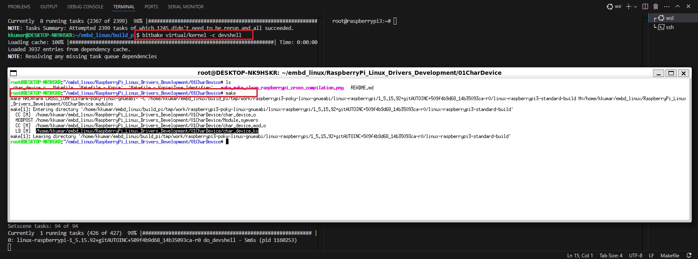

## Create a character device for both WSL2 (Host) and RaspberryPi (Cross-Compilation)

### Step 1: Compile for host
```bash
make
```
```plaintext
kkumar@DESKTOP-NK9HSKR:~/embd_linux/RaspberryPi_Linux_Drivers_Development/01CharDevice$ make
make -C /lib/modules/5.15.153.1-microsoft-standard-WSL2+/build M=/home/kkumar/embd_linux/RaspberryPi_Linux_Drivers_Development/01CharDevice modules
make[1]: Entering directory '/home/kkumar/WSL2-Linux-Kernel'
  CC [M]  /home/kkumar/embd_linux/RaspberryPi_Linux_Drivers_Development/01CharDevice/char_device.o
  MODPOST /home/kkumar/embd_linux/RaspberryPi_Linux_Drivers_Development/01CharDevice/Module.symvers
  CC [M]  /home/kkumar/embd_linux/RaspberryPi_Linux_Drivers_Development/01CharDevice/char_device.mod.o
  LD [M]  /home/kkumar/embd_linux/RaspberryPi_Linux_Drivers_Development/01CharDevice/char_device.ko
make[1]: Leaving directory '/home/kkumar/WSL2-Linux-Kernel'
```

### Step 2: load module
```plaintext
kkumar@DESKTOP-NK9HSKR:~/embd_linux/RaspberryPi_Linux_Drivers_Development/01CharDevice$ sudo insmod char_device.ko
kkumar@DESKTOP-NK9HSKR:~/embd_linux/RaspberryPi_Linux_Drivers_Development/01CharDevice$ dmesg | tail
....
....
[13253.248521] executing ModuleCharacterDeviceInit
[13253.248525] ModuleCharacterDeviceInit device number <major>:<minor> = 240:0
[13253.248673] ModuleCharacterDeviceInit device created successfully..  
```

### Step 3: Check device status
```plaintext
kkumar@DESKTOP-NK9HSKR:~/embd_linux/RaspberryPi_Linux_Drivers_Development/01CharDevice$ cat /sys/class/pdevclass/pdev/dev
240:0
kkumar@DESKTOP-NK9HSKR:~/embd_linux/RaspberryPi_Linux_Drivers_Development/01CharDevice$ cat /sys/class/pdevclass/pdev/uevent 
MAJOR=240
MINOR=0  
DEVNAME=pdev
```

### Step 3: remove module
```plaintext
kkumar@DESKTOP-NK9HSKR:~/embd_linux/RaspberryPi_Linux_Drivers_Development/01CharDevice$ sudo rmmod char_device
kkumar@DESKTOP-NK9HSKR:~/embd_linux/RaspberryPi_Linux_Drivers_Development/01CharDevice$ dmesg | tail
....
....
[13426.935342] executing ModuleCharacterDeviceExit
[13426.935516] ModuleCharacterDeviceExit device cleaned up successfully..
```

### Step 4: Set device permissions (if needed)
```bash
sudo chmod 666 /dev/pdev
sudo chown kkumar:kkumar /dev/pdev
```

```plaintext
kkumar@DESKTOP-NK9HSKR:~/embd_linux/RaspberryPi_Linux_Drivers_Development/01CharDevice$ sudo insmod char_device.ko
[sudo] password for kkumar: 
kkumar@DESKTOP-NK9HSKR:~/embd_linux/RaspberryPi_Linux_Drivers_Development/01CharDevice$ dmesg | grep SINGLE_CHAR_DEVICE
[16013.546055] SINGLE_CHAR_DEVICE: executing ModuleCharacterDeviceInit
[16013.546061] SINGLE_CHAR_DEVICE: ModuleCharacterDeviceInit device number <major>:<minor> = 240:0
[16013.546195] SINGLE_CHAR_DEVICE: ModuleCharacterDeviceInit device created successfully..
[16139.154948] SINGLE_CHAR_DEVICE: executing _open
[16139.154956] SINGLE_CHAR_DEVICE: executing _write, requested 19 bytes
[16139.154981] SINGLE_CHAR_DEVICE: executing _release
[16318.707585] SINGLE_CHAR_DEVICE: executing _open
[16318.707595] SINGLE_CHAR_DEVICE: executing _read, requested 131072 bytes
[16318.707618] SINGLE_CHAR_DEVICE: executing _read, requested 131072 bytes
[16318.707627] SINGLE_CHAR_DEVICE: executing _release
[16487.121518] SINGLE_CHAR_DEVICE: executing ModuleCharacterDeviceExit
[16487.121672] SINGLE_CHAR_DEVICE: ModuleCharacterDeviceExit device cleaned up successfully..
[17636.843632] SINGLE_CHAR_DEVICE: executing ModuleCharacterDeviceInit
[17636.843636] SINGLE_CHAR_DEVICE: ModuleCharacterDeviceInit device number <major>:<minor> = 240:0
[17636.843774] SINGLE_CHAR_DEVICE: ModuleCharacterDeviceInit device created successfully..
kkumar@DESKTOP-NK9HSKR:~/embd_linux/RaspberryPi_Linux_Drivers_Development/01CharDevice$ sudo chown kkumar:kkumar /dev/pdev
kkumar@DESKTOP-NK9HSKR:~/embd_linux/RaspberryPi_Linux_Drivers_Development/01CharDevice$ sudo chmod 666 /dev/pdev
kkumar@DESKTOP-NK9HSKR:~/embd_linux/RaspberryPi_Linux_Drivers_Development/01CharDevice$ echo "test bytes written" > /dev/pdev
kkumar@DESKTOP-NK9HSKR:~/embd_linux/RaspberryPi_Linux_Drivers_Development/01CharDevice$ dmesg | grep SINGLE_CHAR_DEVICE
[16013.546055] SINGLE_CHAR_DEVICE: executing ModuleCharacterDeviceInit
[16013.546061] SINGLE_CHAR_DEVICE: ModuleCharacterDeviceInit device number <major>:<minor> = 240:0
[16013.546195] SINGLE_CHAR_DEVICE: ModuleCharacterDeviceInit device created successfully..
[16139.154948] SINGLE_CHAR_DEVICE: executing _open
[16139.154956] SINGLE_CHAR_DEVICE: executing _write, requested 19 bytes
[16139.154981] SINGLE_CHAR_DEVICE: executing _release
[16318.707585] SINGLE_CHAR_DEVICE: executing _open
[16318.707595] SINGLE_CHAR_DEVICE: executing _read, requested 131072 bytes
[16318.707618] SINGLE_CHAR_DEVICE: executing _read, requested 131072 bytes
[16318.707627] SINGLE_CHAR_DEVICE: executing _release
[16487.121518] SINGLE_CHAR_DEVICE: executing ModuleCharacterDeviceExit
[16487.121672] SINGLE_CHAR_DEVICE: ModuleCharacterDeviceExit device cleaned up successfully..
[17636.843632] SINGLE_CHAR_DEVICE: executing ModuleCharacterDeviceInit
[17636.843636] SINGLE_CHAR_DEVICE: ModuleCharacterDeviceInit device number <major>:<minor> = 240:0
[17636.843774] SINGLE_CHAR_DEVICE: ModuleCharacterDeviceInit device created successfully..
[17677.059988] SINGLE_CHAR_DEVICE: executing _open
[17677.060000] SINGLE_CHAR_DEVICE: executing _write, requested 19 bytes
[17677.060027] SINGLE_CHAR_DEVICE: executing _release
kkumar@DESKTOP-NK9HSKR:~/embd_linux/RaspberryPi_Linux_Drivers_Development/01CharDevice$ cat /dev/pdev
test bytes written
kkumar@DESKTOP-NK9HSKR:~/embd_linux/RaspberryPi_Linux_Drivers_Development/01CharDevice$ dmesg | grep SINGLE_CHAR_DEVICE
[16013.546055] SINGLE_CHAR_DEVICE: executing ModuleCharacterDeviceInit
[16013.546061] SINGLE_CHAR_DEVICE: ModuleCharacterDeviceInit device number <major>:<minor> = 240:0
[16013.546195] SINGLE_CHAR_DEVICE: ModuleCharacterDeviceInit device created successfully..
[16139.154948] SINGLE_CHAR_DEVICE: executing _open
[16139.154956] SINGLE_CHAR_DEVICE: executing _write, requested 19 bytes
[16139.154981] SINGLE_CHAR_DEVICE: executing _release
[16318.707585] SINGLE_CHAR_DEVICE: executing _open
[16318.707595] SINGLE_CHAR_DEVICE: executing _read, requested 131072 bytes
[16318.707618] SINGLE_CHAR_DEVICE: executing _read, requested 131072 bytes
[16318.707627] SINGLE_CHAR_DEVICE: executing _release
[16487.121518] SINGLE_CHAR_DEVICE: executing ModuleCharacterDeviceExit
[16487.121672] SINGLE_CHAR_DEVICE: ModuleCharacterDeviceExit device cleaned up successfully..
[17636.843632] SINGLE_CHAR_DEVICE: executing ModuleCharacterDeviceInit
[17636.843636] SINGLE_CHAR_DEVICE: ModuleCharacterDeviceInit device number <major>:<minor> = 240:0
[17636.843774] SINGLE_CHAR_DEVICE: ModuleCharacterDeviceInit device created successfully..
[17677.059988] SINGLE_CHAR_DEVICE: executing _open
[17677.060000] SINGLE_CHAR_DEVICE: executing _write, requested 19 bytes
[17677.060027] SINGLE_CHAR_DEVICE: executing _release
[17693.518795] SINGLE_CHAR_DEVICE: executing _open
[17693.518805] SINGLE_CHAR_DEVICE: executing _read, requested 131072 bytes
[17693.518828] SINGLE_CHAR_DEVICE: executing _read, requested 131072 bytes
[17693.518837] SINGLE_CHAR_DEVICE: executing _release
kkumar@DESKTOP-NK9HSKR:~/embd_linux/RaspberryPi_Linux_Drivers_Development/01CharDevice$ sudo rmmod char_device
kkumar@DESKTOP-NK9HSKR:~/embd_linux/RaspberryPi_Linux_Drivers_Development/01CharDevice$ dmesg | grep SINGLE_CHAR_DEVICE
[16013.546055] SINGLE_CHAR_DEVICE: executing ModuleCharacterDeviceInit
[16013.546061] SINGLE_CHAR_DEVICE: ModuleCharacterDeviceInit device number <major>:<minor> = 240:0
[16013.546195] SINGLE_CHAR_DEVICE: ModuleCharacterDeviceInit device created successfully..
[16139.154948] SINGLE_CHAR_DEVICE: executing _open
[16139.154956] SINGLE_CHAR_DEVICE: executing _write, requested 19 bytes
[16139.154981] SINGLE_CHAR_DEVICE: executing _release
[16318.707585] SINGLE_CHAR_DEVICE: executing _open
[16318.707595] SINGLE_CHAR_DEVICE: executing _read, requested 131072 bytes
[16318.707618] SINGLE_CHAR_DEVICE: executing _read, requested 131072 bytes
[16318.707627] SINGLE_CHAR_DEVICE: executing _release
[16487.121518] SINGLE_CHAR_DEVICE: executing ModuleCharacterDeviceExit
[16487.121672] SINGLE_CHAR_DEVICE: ModuleCharacterDeviceExit device cleaned up successfully..
[17636.843632] SINGLE_CHAR_DEVICE: executing ModuleCharacterDeviceInit
[17636.843636] SINGLE_CHAR_DEVICE: ModuleCharacterDeviceInit device number <major>:<minor> = 240:0
[17636.843774] SINGLE_CHAR_DEVICE: ModuleCharacterDeviceInit device created successfully..
[17677.059988] SINGLE_CHAR_DEVICE: executing _open
[17677.060000] SINGLE_CHAR_DEVICE: executing _write, requested 19 bytes
[17677.060027] SINGLE_CHAR_DEVICE: executing _release
[17693.518795] SINGLE_CHAR_DEVICE: executing _open
[17693.518805] SINGLE_CHAR_DEVICE: executing _read, requested 131072 bytes
[17693.518828] SINGLE_CHAR_DEVICE: executing _read, requested 131072 bytes
[17693.518837] SINGLE_CHAR_DEVICE: executing _release
[17713.568753] SINGLE_CHAR_DEVICE: executing ModuleCharacterDeviceExit
[17713.568999] SINGLE_CHAR_DEVICE: ModuleCharacterDeviceExit device cleaned up successfully..
```

## Let's prepare enviroment for RaspberryPi (Cross-Compilation)

[RaspberryPi build env setup on WSL2](https://github.com/Kishwar/RaspberryPi_Linux_Drivers_Development/blob/main/README.md)

### 1. Build the Yocto Toolchain for the Raspberry Pi (if not already built)
```bash
bitbake meta-toolchain
```

### 2. Source the Toolchain Environment Script
After building the toolchain, Yocto will generate a toolchain setup script (e.g., environment-setup-cortexa7t2hf-neon-vfpv4-poky-linux-gnueabi). This script sets up the necessary cross-compilation variables.
```bash
source tmp/sysroots/raspberrypi3/imgdata/core-image-minimal.env
```

### 3. Get the RaspberryPi Kernel Headers
You need the kernel headers for your specific RaspberryPi kernel version. Use the Yocto build system to extract and set up the headers.
```bash
bitbake virtual/kernel -c devshell
```
Above command will open devshell. You will need to build LKM inside the window.


