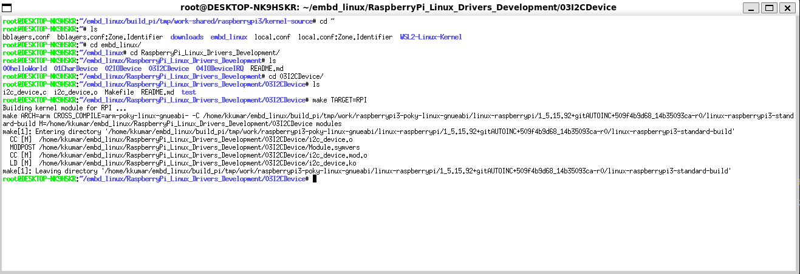

## Create a IO device for RaspberryPi (Cross-Compilation) using WSL2

```bash
kkumar@DESKTOP-NK9HSKR:/mnt/c/Users/kumar$ uname -a
Linux DESKTOP-NK9HSKR 5.15.153.1-microsoft-standard-WSL2+ #2 SMP Thu Oct 3 10:36:07 CEST 2024 x86_64 x86_64 x86_64 GNU/Linux
```
[RaspberryPi build env setup on WSL2](https://github.com/Kishwar/RaspberryPi_Linux_Drivers_Development/blob/main/README.md)

### 1. Build the Yocto Toolchain for the Raspberry Pi (if not already built)
```bash
bitbake meta-toolchain
```

### 2. Source the Toolchain Environment Script
After building the toolchain, Yocto will generate a toolchain setup script (e.g., environment-setup-cortexa7t2hf-neon-vfpv4-poky-linux-gnueabi). This script sets up the necessary cross-compilation variables.
```bash
source tmp/sysroots/raspberrypi3/imgdata/core-image-minimal.env
```

### 3. Get the RaspberryPi Kernel Headers
You need the kernel headers for your specific RaspberryPi kernel version. Use the Yocto build system to extract and set up the headers.
```bash
bitbake virtual/kernel -c devshell
```
Above command will open devshell. You will need to build LKM inside the window.



### 4. Load and output from RaspberryPi
```bash
PS X:\home\kkumar\embd_linux\RaspberryPi_Linux_Drivers_Development\03I2CDevice> scp i2c_device.ko root@192.168.178.98:/home/root/chardevice/i2c_device.ko   100% 9604   415.2KB/s   00:00
```
```plaintext
root@raspberrypi3:~/chardevice# insmod i2c_device.ko
root@raspberrypi3:~/chardevice# dmesg | tail
....
[16686.182952] SINGLE_CHAR_I2C_DEVICE: executing ModuleCharacterDeviceInit
[16686.189698] SINGLE_CHAR_I2C_DEVICE: ModuleCharacterDeviceInit device number <major>:<minor> = 241:0
[16686.199487] SINGLE_CHAR_I2C_DEVICE: ModuleCharacterDeviceInit BMP280 Driver added!
[16686.207749] SINGLE_CHAR_I2C_DEVICE: ModuleCharacterDeviceInit ID: 0x60
[16686.216702] SINGLE_CHAR_I2C_DEVICE: ModuleCharacterDeviceInit device created successfully..

root@raspberrypi3:~/chardevice# ls -l /dev/pdev
crw-------    1 root     root      241,   0 Oct  4 18:37 /dev/pdev
```

### 5. Compile test code (test/AppTemperature.c)
```bash
cd test
arm-linux-gnueabihf-gcc -o AppTemperature AppTemperature.c
```

### 6. Load and run on RaspberryPi
```bash
PS X:\home\kkumar\embd_linux\RaspberryPi_Linux_Drivers_Development\03I2CDevice\test> scp .\AppTemperature root@192.168.178.98:/home/root/chardevice/AppTemperature    100%   16KB 721.3KB/s   00:00
```
Make sure /dev/pdev is loaded (see step 4)

```bash
PS X:\home\kkumar\embd_linux\RaspberryPi_Linux_Drivers_Development\03I2CDevice\test> ssh root@192.168.178.98
Last login: Fri Oct  4 18:12:26 2024 from 192.168.178.37
root@raspberrypi3:~# cd chardevice/
root@raspberrypi3:~/chardevice# ls
AppTemperature  i2c_device.ko
root@raspberrypi3:~/chardevice# ./AppTemperature
2024-10-07 19:30:22: 24.21C
2024-10-07 19:30:32: 24.21C
2024-10-07 19:30:42: 24.21C
2024-10-07 19:30:52: 24.22C
2024-10-07 19:31:02: 24.23C
2024-10-07 19:31:12: 24.24C
2024-10-07 19:31:22: 24.24C
2024-10-07 19:31:32: 24.23C
2024-10-07 19:31:42: 24.23C
2024-10-07 19:31:52: 24.22C
read /dev/pdev 10 times.
root@raspberrypi3:~/chardevice#
```
